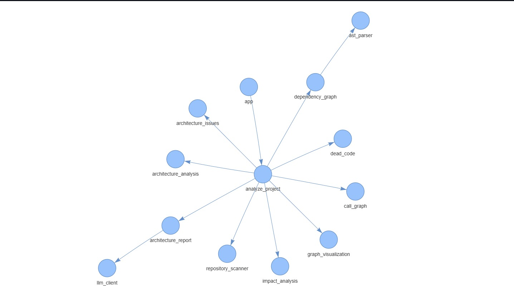
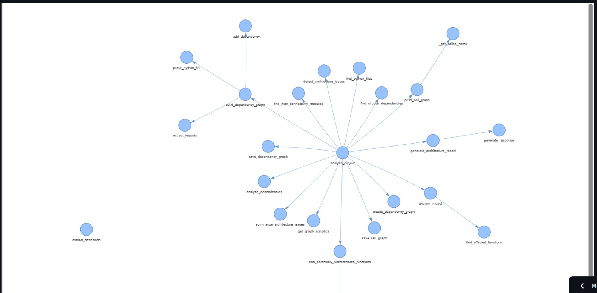
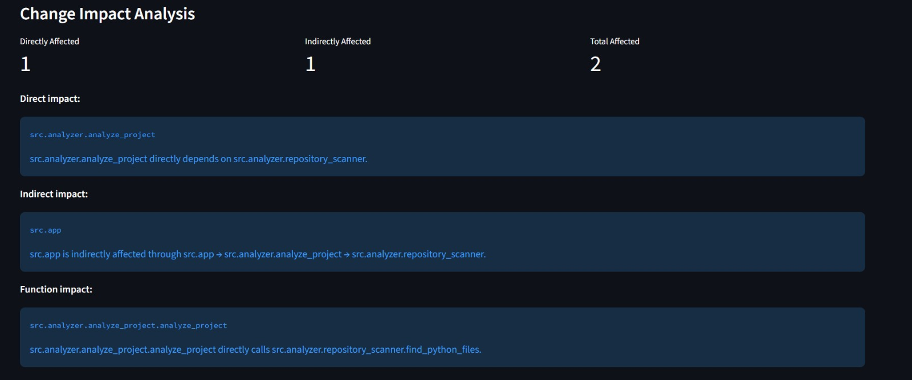
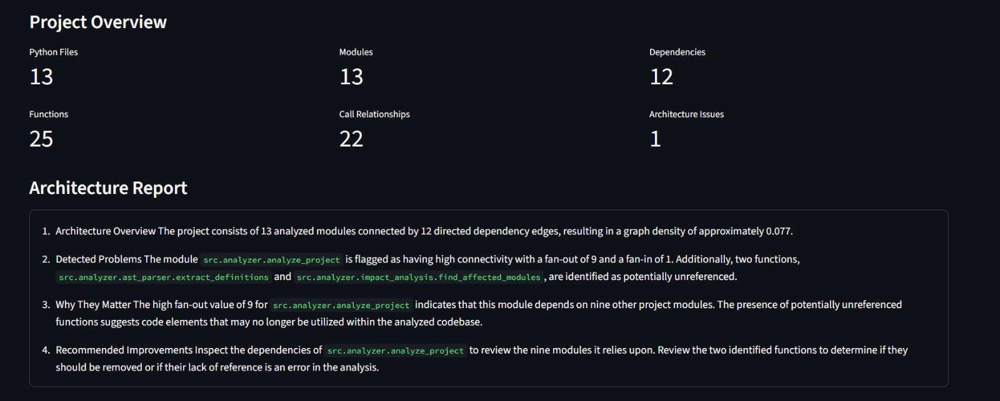
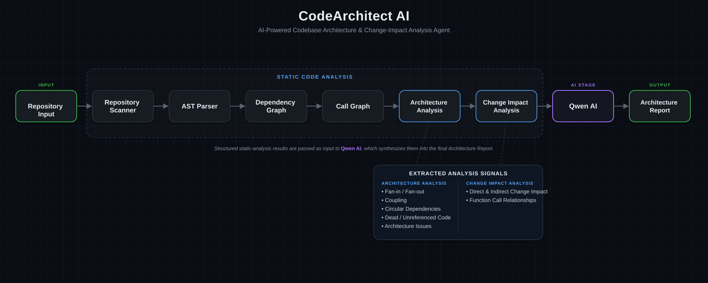

<p align="center">
  
</p>

<h1 align="center">🏗️ CodeArchitect AI</h1>

<p align="center">
  <strong>AI-powered codebase architecture and change-impact analysis platform.</strong>
</p>

<p align="center">
  
  
  
  
  
  
  
</p>

---

CodeArchitect AI analyzes Python repositories using static analysis and graph-based techniques to understand their architecture, dependencies, function relationships, potential architecture issues, potentially unreferenced functions, and the impact of changing a module or function.

The project combines **Python AST analysis, NetworkX graphs, PyVis visualization, and AI-generated architecture reports** to provide a structured view of a codebase.

---

## 🚀 What Problem Does It Solve?

As codebases grow, it becomes difficult to understand:

* Which modules depend on each other?
* Which functions call other functions?
* Which modules are highly connected?
* Are there circular dependencies?
* Which functions may not be referenced?
* What parts of the codebase could be affected if a module or function changes?
* Where might architectural improvements be needed?

CodeArchitect AI automates these analysis tasks and presents the results through an interactive Streamlit dashboard.

---

## ✨ Features

### 📂 Repository Analysis

Analyze a local Python repository or upload a repository as a ZIP file.

The analyzer discovers Python files while excluding generated and dependency directories such as:

* `.venv`
* `.git`
* `__pycache__`
* `github-test-repo`

---

### 🔗 Dependency Graph

Builds a directed graph representing module-to-module dependencies based on Python imports.

The dashboard provides an interactive visualization of the dependency structure.

<p align="center">
  
</p>

---

### ☎️ Call Graph

Analyzes Python functions and their relationships to determine which project-defined functions call other functions.

The resulting call graph can be explored interactively.

<p align="center">
  
</p>

---

### 🏛️ Architecture Analysis

Calculates architecture-related metrics including:

* Fan-in
* Fan-out
* Graph density
* Strongly connected components
* Highly connected modules
* Circular dependencies
* Coupling-related issues

---

### ⚠️ Architecture Issue Detection

The system currently detects issues such as:

* Circular dependencies
* Highly connected modules
* High coupling patterns

Each detected issue is presented with a severity level and explanation.

---

### 🧹 Potentially Unreferenced Functions

The analyzer identifies functions that are not reachable from configured entry points.

These functions are classified as potentially unreferenced rather than automatically considered dead code, since static analysis cannot always determine runtime usage with certainty.

---

### 🔍 Change Impact Analysis

One of the main features of CodeArchitect AI.

You can specify a changed:

* Module
* Function

The system determines:

* Directly affected modules
* Indirectly affected modules
* Total affected modules
* Direct and indirect function impact
* Dependency paths explaining why an element is affected

For example:

```text
repository_scanner
        ↓
analyze_project
        ↓
app
```

If `repository_scanner` changes, the system can identify `analyze_project` as directly affected and `app` as indirectly affected.

<p align="center">
  
</p>

---

### 🤖 AI Architecture Report

The analyzed architecture information is converted into a structured report containing:

1. Architecture overview
2. Detected problems
3. Why the problems matter
4. Recommended improvements

The current implementation uses a **Groq-hosted Qwen model** for report generation.

---

### 📊 Interactive Dashboard

The Streamlit dashboard presents:

* Project overview
* Architecture report
* Dependency graph
* Call graph
* Analysis summary
* Architecture issues
* Potentially unreferenced functions
* Change impact analysis

<p align="center">
  
</p>

---

## 🧠 How It Works

The analysis pipeline is approximately:

<p align="center">
  
</p>

The underlying flow is:

```text
Python Repository
       │
       ▼
Repository Scanner
       │
       ▼
Python AST Parsing
       │
       ├───────────────┐
       ▼               ▼
Dependency Analysis   Function Analysis
       │               │
       ▼               ▼
Dependency Graph     Call Graph
       │               │
       └───────┬───────┘
               ▼
       Architecture Analysis
               │
       ├───────────────┐
       ▼               ▼
Architecture Issues   Dead/Unused Analysis
       │
       ▼
Change Impact Analysis
       │
       ▼
Structured Analysis Data
       │
       ▼
Qwen AI Report Generation
       │
       ▼
Streamlit Dashboard
```

---

## 🏗️ Project Architecture

```text
CodeArchitectAI/

│
├── src/
│   ├── app.py
│   │
│   └── analyzer/
│       ├── repository_scanner.py
│       ├── ast_parser.py
│       ├── dependency_graph.py
│       ├── architecture_analysis.py
│       ├── call_graph.py
│       ├── impact_analysis.py
│       ├── dead_code.py
│       ├── architecture_issues.py
│       ├── llm_client.py
│       ├── architecture_report.py
│       ├── analyze_project.py
│       └── graph_visualization.py
│
├── outputs/
│
├── assets/
│   ├── codearchitect-banner.svg
│   ├── architecture-pipeline.svg
│   ├── dashboard-overview.png
│   ├── dependency-graph.png
│   ├── call-graph.png
│   └── change-impact.png
│
├── .gitignore
├── requirements.txt
└── README.md
```

---

## 🛠️ Tech Stack

| Technology       | Purpose                         |
| ---------------- | ------------------------------- |
| **Python**       | Core implementation             |
| **Python AST**   | Static source-code analysis     |
| **NetworkX**     | Dependency and call graphs      |
| **PyVis**        | Interactive graph visualization |
| **Streamlit**    | Web dashboard                   |
| **Groq**         | AI inference                    |
| **Qwen**         | Architecture report generation  |
| **Git / GitHub** | Version control                 |

---

## ⚙️ Local Setup

### 1. Clone the repository

```bash
git clone https://github.com/ayush2281/CodeArchitectAi.git
cd CodeArchitectAI
```

### 2. Create a virtual environment

```bash
python -m venv .venv
```

### 3. Activate it on Windows PowerShell

```powershell
.\.venv\Scripts\Activate.ps1
```

### 4. Install dependencies

```bash
pip install -r requirements.txt
```

### 5. Configure the Groq API key

Set the `GROQ_API_KEY` environment variable.

PowerShell example:

```powershell
$env:GROQ_API_KEY="your_api_key"
```

**Never commit your API key to GitHub.**

### 6. Run the dashboard

```bash
streamlit run src/app.py
```

The Streamlit application will open in your browser.

---

## 🔎 Using Change Impact Analysis

After selecting a repository, optional fields can be provided.

### Changed module

Example:

```text
src.analyzer.repository_scanner
```

### Changed function

Example:

```text
src.analyzer.repository_scanner.find_python_files
```

### Entry point

Example:

```text
src.analyzer.analyze_project.analyze_project
```

The system then traces dependency relationships to determine the affected parts of the codebase.

---

## 📈 Example Analysis

For the CodeArchitect AI project itself, the analyzer can identify:

* Python modules
* Project-defined functions
* Module dependencies
* Function call relationships
* Highly connected modules
* Potentially unreferenced functions
* Direct and indirect change impact

### Example impact

```text
Changed:

src.analyzer.repository_scanner.find_python_files

        │
        ▼

Direct:

src.analyzer.analyze_project.analyze_project

        │
        ▼

Indirect:

src.app
```

---

## 🖥️ Screenshots / Demo

The following screenshots demonstrate the major parts of the CodeArchitect AI dashboard.

### Repository Analysis & Architecture Report

<p align="center">
  
</p>

### Dependency Graph

<p align="center">
  
</p>

### Call Graph

<p align="center">
  
</p>

### Change Impact Analysis

<p align="center">
  
</p>

---

## ⚠️ Limitations

CodeArchitect AI currently focuses on **Python static analysis**.

Some analysis results should be interpreted as potential findings rather than absolute conclusions.

For example:

* A function identified as unreferenced may still be used dynamically.
* Static import analysis cannot capture every runtime dependency.
* Dynamic function calls may not always be resolved.
* Architecture metrics are indicators and require developer interpretation.
* AI-generated recommendations should be reviewed by a developer before being applied.

---

## 🔮 Future Improvements

Potential future improvements include:

* Support for additional programming languages
* More advanced dead-code detection
* Better dynamic import analysis
* GitHub repository integration
* Pull-request change-impact analysis
* Historical architecture tracking
* More detailed dependency metrics
* Automated architecture diagrams
* Improved natural-language codebase querying
* Automated refactoring suggestions
* Test coverage integration

---

## 👨‍💻 Author

**Ayush**

B.Tech — Computer Science & Artificial Intelligence

---

## 📄 License

This project is intended as an academic and portfolio project.